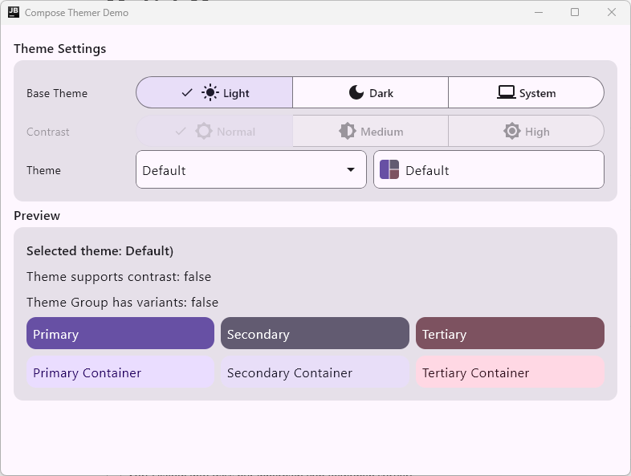
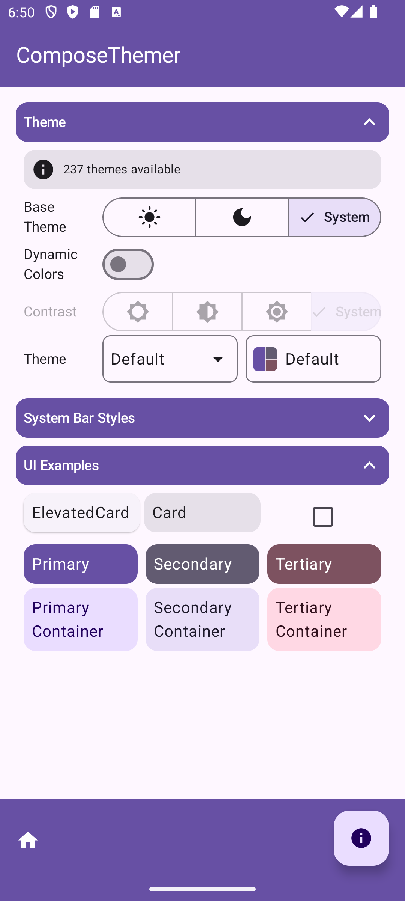
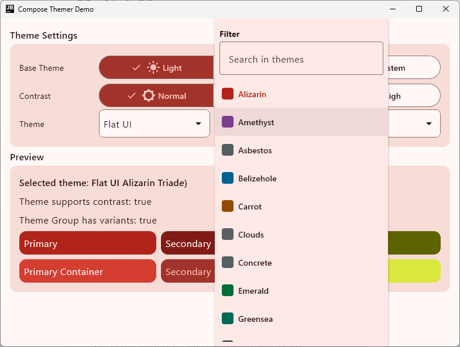
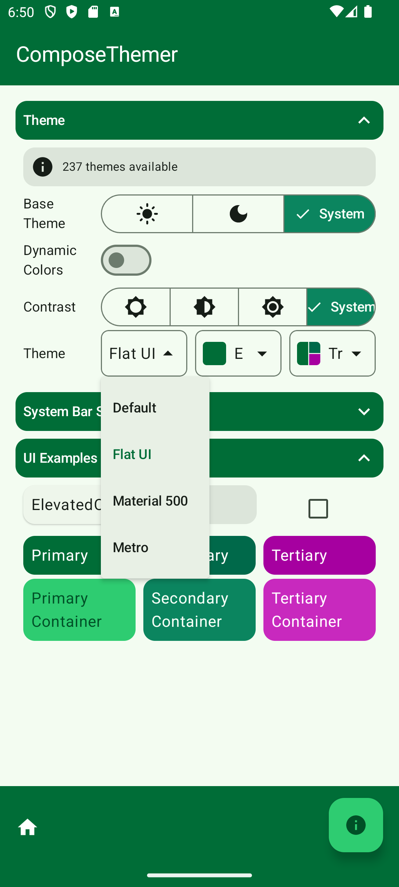
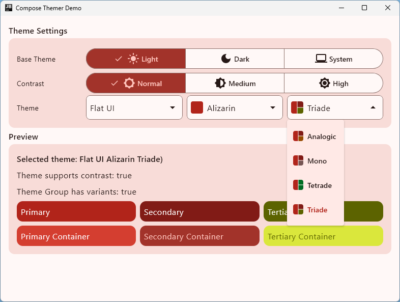
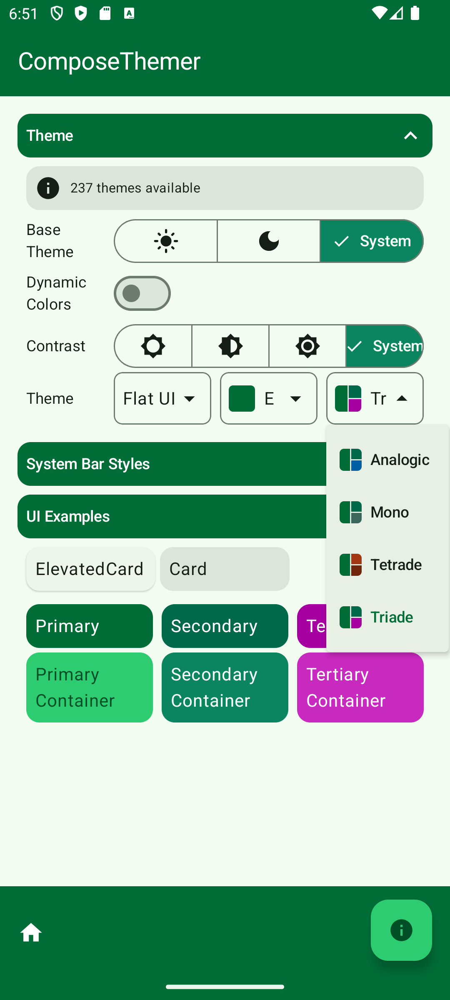
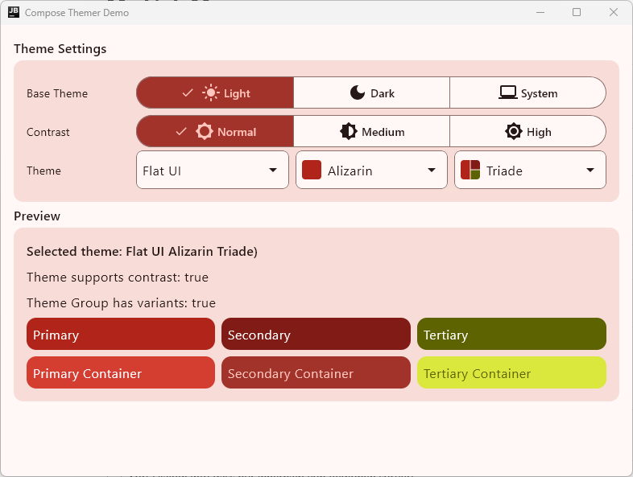
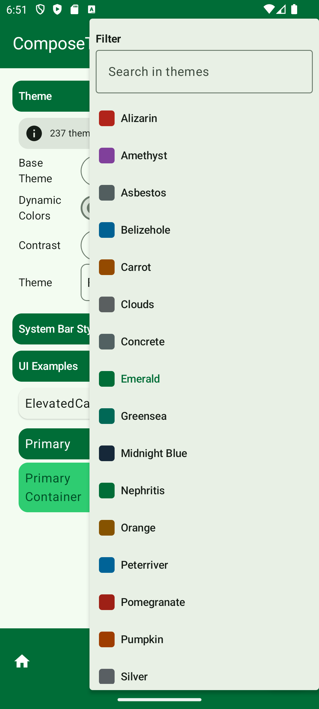
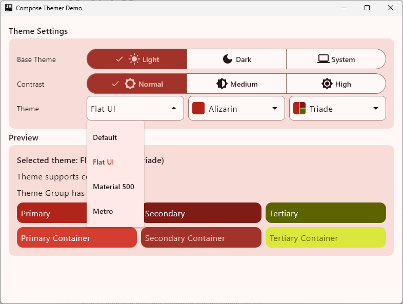

[](https://central.sonatype.com/artifact/io.github.mflisar.composethemer/core)   
# ComposeThemer
     

This library provides following main features:

* allows to define custom user themes and applies them automatically
* ability to retrieve all registered themes
* supports system ui theming (status bar + navigation bar)
* build on top of `MaterialTheme`
* supports *dynamic theming* as well as system and user *contrast* settings
* comes with optional collections of predefined themes
    * metro colors based theme collection
    * flat UI based theme collection
    * material 500 colors based theme collection
* offers some edgeToEdge helper functions

> [!NOTE]
> All features are splitted into separate modules, just include the modules you want to use!

# Table of Contents

- [Screenshots](#camera-screenshots)
- [Supported Platforms](#computer-supported-platforms)
- [Versions](#arrow_right-versions)
- [Setup](#wrench-setup)
- [Usage](#rocket-usage)
- [Modules](#file_folder-modules)
- [Demo](#sparkles-demo)
- [More](#information_source-more)
- [API](#books-api)
- [Other Libraries](#bulb-other-libraries)

# :camera: Screenshots











# :computer: Supported Platforms

| Module | android | iOS | windows | macOS | wasm |
|---|---|---|---|---|---|
| core | ✅ | ✅ | ✅ | ✅ | ✅ |
| modules-picker | ✅ | ✅ | ✅ | ✅ | ✅ |
| modules-defaultpicker | ✅ | ✅ | ✅ | ✅ | ✅ |
| themes-flatui | ✅ | ✅ | ✅ | ✅ | ✅ |
| themes-material500 | ✅ | ✅ | ✅ | ✅ | ✅ |
| themes-metro | ✅ | ✅ | ✅ | ✅ | ✅ |

# :arrow_right: Versions

| Dependency | Version |
|---|---|
| Kotlin | `2.3.20` |
| Jetbrains Compose | `1.10.3` |
| Jetbrains Compose Material3 | `1.9.0` |

# :wrench: Setup

<details open>

<summary><b>Using Version Catalogs</b></summary>

<br>

Define the dependencies inside your **libs.versions.toml** file.

```toml
[versions]

composethemer = "<LATEST-VERSION>"

[libraries]

composethemer-core = { module = "io.github.mflisar.composethemer:core", version.ref = "composethemer" }
composethemer-modules-picker = { module = "io.github.mflisar.composethemer:modules-picker", version.ref = "composethemer" }
composethemer-modules-defaultpicker = { module = "io.github.mflisar.composethemer:modules-defaultpicker", version.ref = "composethemer" }
composethemer-themes-flatui = { module = "io.github.mflisar.composethemer:themes-flatui", version.ref = "composethemer" }
composethemer-themes-material500 = { module = "io.github.mflisar.composethemer:themes-material500", version.ref = "composethemer" }
composethemer-themes-metro = { module = "io.github.mflisar.composethemer:themes-metro", version.ref = "composethemer" }
```

And then use the definitions in your projects **build.gradle.kts** file like following:

```java
implementation(libs.composethemer.core)
implementation(libs.composethemer.modules.picker)
implementation(libs.composethemer.modules.defaultpicker)
implementation(libs.composethemer.themes.flatui)
implementation(libs.composethemer.themes.material500)
implementation(libs.composethemer.themes.metro)
```

</details>

<details>

<summary><b>Direct Dependency Notation</b></summary>

<br>

Simply add the dependencies inside your **build.gradle.kts** file.

```kotlin
val composethemer = "<LATEST-VERSION>"

implementation("io.github.mflisar.composethemer:core:${composethemer}")
implementation("io.github.mflisar.composethemer:modules-picker:${composethemer}")
implementation("io.github.mflisar.composethemer:modules-defaultpicker:${composethemer}")
implementation("io.github.mflisar.composethemer:themes-flatui:${composethemer}")
implementation("io.github.mflisar.composethemer:themes-material500:${composethemer}")
implementation("io.github.mflisar.composethemer:themes-metro:${composethemer}")
```

</details>

# :rocket: Usage

#### 1) Register available themes

You should do this once only, e.g. in your `Application` class.

```kotlin
// register all themes that you want to use (our just a subset of them, even a single one is enough)
val allThemes: List<ComposeTheme.Theme> =
    DefaultThemes.getAllThemes() +
            MetroThemes.getAllThemes() +
            FlatUIThemes.getAllThemes() +
            Material500Themes.getAllThemes()
ComposeTheme.register(*allThemes.toTypedArray())
```

## 2) Apply the theme

```kotlin

// create a state that holds the current theme settings
val baseTheme = rememberSaveable { mutableStateOf(ComposeTheme.BaseTheme.System) }
val contrast = rememberSaveable { mutableStateOf(ComposeTheme.Contrast.Normal) }
val dynamic = rememberSaveable { mutableStateOf(false) }
val theme = rememberSaveable { mutableStateOf(ThemeDefault.Theme.id) } // id of the current theme
val state = ComposeTheme.State(baseTheme, contrast, dynamic, theme)

// use ComposeTheme instead of MaterialTheme
ComposeTheme(state = state) {
    // app content
}
```

## 3) Navigation and statusbar theming

On android you can use `ComposeTheme` to set the status bar and navigation bar colors based on the current theme.

```kotlin
ComposeTheme(
    state = state
) {
    // set the color that you use behind the status bar and navigation bar (e.g. primary toolbar + surface bottom navigation)
    val statusBarColor = ...
    val navigationBarColor = ...

    // UpdateEdgeToEdgeDefault...helper function to easily enable edgeToEdge
    // SystemBarStyle also offers some extensions (statusBar, navigationBar, transparent) that can be used

    // this app draws a bottom navigation behind the navigation bar in portrait only, in landscape mode it doesn't
    val landscape = LocalConfiguration.current.orientation == Configuration.ORIENTATION_LANDSCAPE
    val isDark = state.base.value.isDark()

    UpdateEdgeToEdgeDefault(
        activity = this,
        themeState = state,
        statusBarColor = statusBarColor,
        navigationBarColor = if (landscape) {
            SystemBarStyle.defaultScrim(resources, isDark)
        } else navigationBarColor,
        isNavigationBarContrastEnforced = landscape
    )
}
```

# :file_folder: Modules

- [Default Picker](documentation/Modules/Default%20Picker.md)
- [Picker](documentation/Modules/Picker.md)

# :sparkles: Demo

A full [demo](/demo) is included inside the demo module, it shows nearly every usage with working examples.

# :information_source: More

- Themes
  - [Flat UI](documentation/Themes/Flat%20UI.md)
  - [Material 500](documentation/Themes/Material%20500.md)
  - [Metro](documentation/Themes/Metro.md)

# :books: API

Check out the [API documentation](https://MFlisar.github.io/ComposeThemer/).

# :bulb: Other Libraries

You can find more libraries (all multiplatform) of mine that all do work together nicely [here](https://mflisar.github.io/Libraries/).
